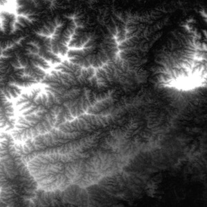

### Determine where water will flow to based on height GIS data

## Pictures

**Sample of input data:**

 
## Method

1. Load data and convert it to a 2 dimensional list of height information
2. Convert each of the heights into a node
3. Connect each node to it's neighbours (above, below and to each size)
4. If two nodes of equal height are neighbours then merge them into one node
    1. Iterate through all nodes and check each of their neighbours altitudes
    2. If neighbour height is equal then merge the two nodes
    3. Update the border status and location info of the node.
    4. Remove flow between the two nodes which are being merged.
    5. Move all the connections that go to the node which is being merged to the new node.
    6. Add all the connections of the old node to the new node.
    7. Update the linked list so that it does not contain the node that was moved.
5. For all nodes which touch the edge of the map/area mark them as border nodes
6. Store all the nodes in a sorted linked list
7. Flood low nodes;
    1. Find all the nodes which are below all their neighbours. These nodes are called lakes.
    2. For each of these lakes add all of the neighbours (the perimeter of the lake) to collection sorted by height
    3. Starting from the lowest neighbour check if it is below the level of the lake. If it is then the flooding is complete.
    4. Otherwise merge the node into the lake and raise the height of the lake to be equal to the node that was just merged into the lake. Add the neighbours of the node that is being merged into the sorted collection of lake neighbours.
9. Starting from the highest node send flow down to lower nodes
10. Create images for each step as flow is sent down and compile into an animation

## Data

Landsat 8 data from ASTGTM. 30m spaced grid of height data. [Link to dataset info.](https://lpdaac.usgs.gov/dataset_discovery/aster/aster_products_table/astgtm)

<!--
# Instructions for running

TODO
 -->

## Tests

Run the tests with `python -m unittest discover tests`

## Folders

* `/data_structures` holds the node and location_graph types
* `/algorithms` holds the code used to simulate flooding and flow
* `/utils` deals with loading data, making images and preprocessing
* `/data` holds the raw data

## Todo

* finish flooding tests
* write flooding algorithm
* code the imagewriter
* prep a 5% size dataset sample
* flood the dataset
* flow the dataset
* check the images
