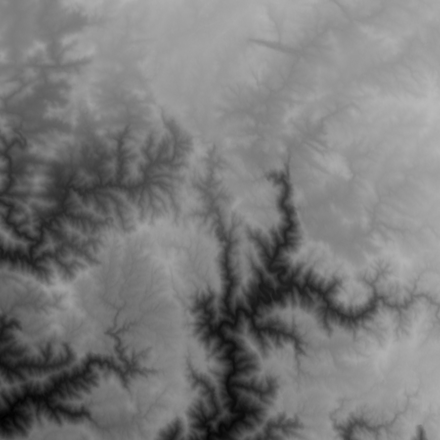
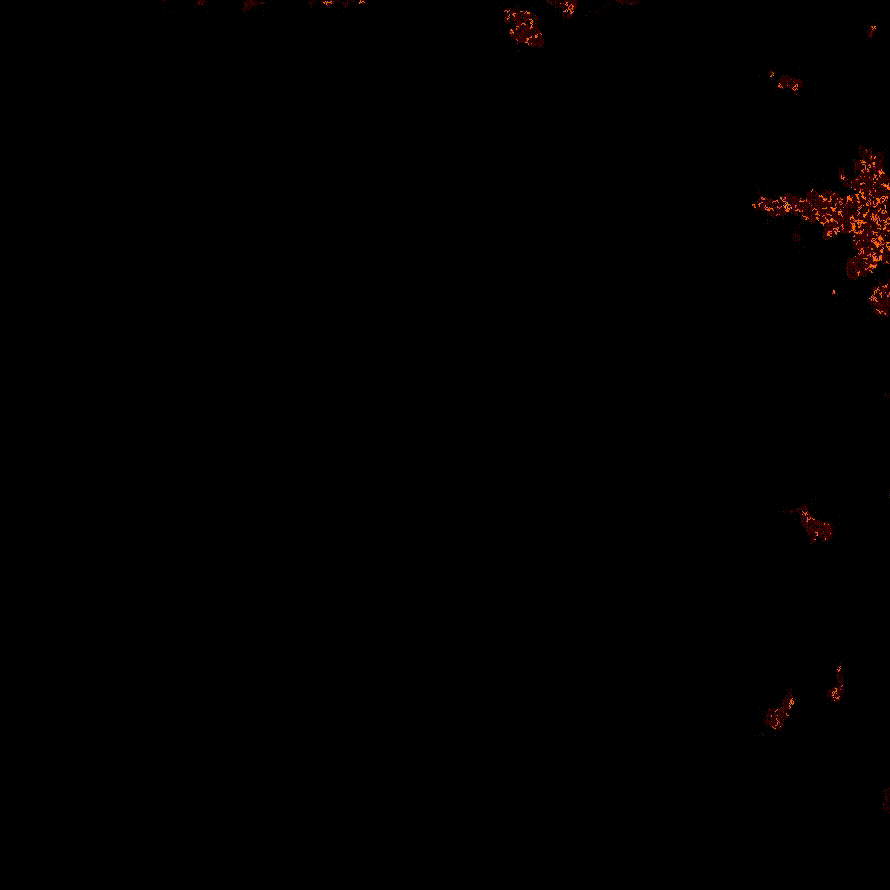
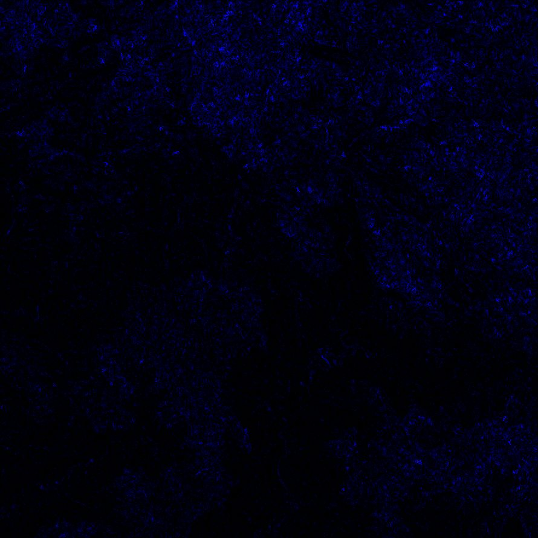

### Determine where water will flow to based on height GIS data

## Pictures

**Sample of input height map data:**

**Visualization of flow:**

**Visualization of equal height areas being merged into single points:**

## Usage

1. Use python 3 and install dependencies.
`pip install -r requirements.txt`
2. Start jupyter notebook with `jupyter notebook` and open /src/notebook/
3. Run the notebook and view the output in the `/data/video/{job_name}` folder.

## Method

1. Load data and convert it to a 2 dimensional list of height information
2. Convert each of the heights into a node
3. For all nodes which touch the edge of the map/area mark them as border nodes
4. Connect each node to it's neighbours (touching including diagonally)
5. If two nodes of equal height are neighbours then merge them into one node
6. Convert the 2d grid of nodes into a 1d list
7. Sort the list by node altitude, and convert the list into a linked list.
9. Starting from the highest node send flow down to lower nodes.
10. Iterate over the linked list in the desce
nding altitude order and display the flow as an animation.

## Equal heigh node merging

1. Loop over every node by rows then columns
2. Skip any node marked as deleted
3. Check to see if any of the nodes neighbours are the same height.
4. Use a breadth first to find all the equal height nodes that are connected to this node.
5. Merge all the nodes found in the search into the original node.
    1. If any node found is a border then the original node becomes a border
    2. All the nodes found during the search are marked as deleted
    3. The position of the original node is updated to include all the points found
    4. The outflow of the original node is now all the outflows of the attached nodes which do not connect to one of the other attached nodes.

## Node flooding (not implemented)

**Flood low nodes;**

1. Find all the nodes which are below all their neighbours. These nodes are called lakes.
2. For each of these lakes add all of the neighbours (the perimeter of the lake) to collection sorted by height
3. Starting from the lowest neighbour check if it is below the level of the lake. If it is then the flooding is complete.
4. Otherwise merge the node into the lake and raise the height of the lake to be equal to the node that was just merged into the lake. Add the neighbours of the node that is being merged into the sorted collection of lake neighbours.

## Data

Landsat 8 data from ASTGTM. 30m spaced grid of height data. [Link to dataset info.](https://lpdaac.usgs.gov/dataset_discovery/aster/aster_products_table/astgtm)

## Tests

Run the tests with `python -m unittest discover tests`

## Folder structure

* `/algorithms` holds the code used to simulate flooding and flow
* `/data` holds the raw elevation data
* `/data_structures` holds the node and location_graph types
* `/notebooks` holds jupyter notebooks which do the flow simulations
* `/tests` holds testing code
* `/utils` deals with loading data, making images and preprocessing

## Video commands

To convert a directory of `.tiff` files into a video.

`ffmpeg -i ./%d.tiff  -c:v ffv1 -qscale:v 0 ../video/test.avi`

## Todo

- Write first and last frames to video file
- Flooding
- Move data into data directory
- Pipe data directly into ffmpeg instead of writing images
